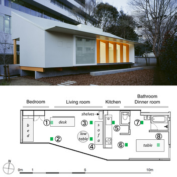
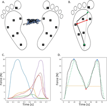
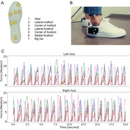

<strong>Physical Behavior Assessment Lab</strong> (Ochanomizu University, Tokyo) | <a href="http://www.eng.ocha.ac.jp/Tripette_Site/home.html">Homepage</a>

 We are evaluating physical activity in various populations using wearable activity trackers. We are also developping new hardware and software methods for the measurement of physical behaviours. For example, machine learning techniques are employed to develop algorithms capable of recognizing physical behaviors using data collected from wearable devices.

 Our research goals are:
<ol>
<li>to understand the relationship between physical activity, health and well-being in various populations.</li>
<li>to develop new technologies to support more accurate measurements of physical behaviors.</li>
<li>to promote physical activty as a primary component of a sustainable society.</li>
</ol>

<strong>This GitHub organization hosts code developed for our projects, which require original data processing and statistical analysis</strong>.

<h3 id="Selected articles">Selected articles</h3>

Nakajima Y, Kitayama A, Ohta Y, et al. <strong> Objective Assessment of Physical Activity at Home Using a Novel Floor-Vibration Monitoring System: Validation and Comparison With Wearable Activity Trackers and Indirect Calorimetry Measurements</strong>. <i>JMIR Form Res. 2024;8:e51874</i>. Published 2024 Apr 25. doi:10.2196/51874. 
This study evaluated the feasibility of estimating physical activity through floor vibration monitoring. Accelerometer sensors were installed in a smart home floor to capture vibration data from 10 participants during four activities. Energy expenditure was measured via indirect calorimetry, and Actigraph trackers were used to estimate both energy expenditure and step count. Models based on features extracted from floor vibrations outperformed Actigraph trackers in estimating both metrics.
<a class="tag" href="https://doi.org/10.2196/51874">DOI</a> |
<a class="tag" href="https://formative.jmir.org/2024/1/e51874">URL</a> |
<a class="tag" href="https://formative.jmir.org/2024/1/e51874/PDF">PDF</a>

Anzai E, Ren D, Cazenille L, et al. <strong>Random forest algorithms to classify frailty and falling history in seniors using plantar pressure measurement insoles: a large-scale feasibility study</strong>. <i>BMC Geriatr. 2022;22(1):746</i>. Published 2022 Sep 12. doi:10.1186/s12877-022-03425-5. 
This study proposes an objective method to complement existing tools for identifying frailty in seniors. Seven hundred twelve senior participantscompleted a balance test and walking trial, with plantar pressure data collected via 7-sensor insoles. Frailty, assessed using the Kihon Checklist, was classified with 75% accuracy using random forest algorithms on 184 extracted features. These findings suggest smart insoles could help clinicians in early frailty detection.
<a class="tag" href="https://doi.org/10.1186/s12877-022-03425-5">DOI</a> |
<a class="tag" href="https://bmcgeriatr.biomedcentral.com/articles/10.1186/s12877-022-03425-5">URL</a> |
<a class="tag" href="Articles/s12877-022-03425-5.pdf">PDF</a>

  

Ren D, Aubert-Kato N, Anzai E, et al. <strong>Random forest algorithms for recognizing daily life activities using plantar pressure information: a smart-shoe study</strong>. <i></i>PeerJ. 2020;8:e10170</i>. Published 2020 Oct 28. doi:10.7717/peerj.10170. 
This study developed an algorithm to recognize activities using plantar pressure data from smart shoes. Seventeen participants performed nine sedentary and locomotive activities, and random forest models processed the data. A 20-second window length achieved 89% accuracy. "Running" showed 100% sensitivity, while "walking up a slope" had the lowest (63%). Minimal sensor setups (2-3 sensors) still performed well. Smart shoes could help assess daily activities.
<a class="tag" href="https://doi.org/10.7717/peerj.10170">DOI</a> |
<a class="tag" href="https://peerj.com/articles/10170/">URL</a> |
<a class="tag" href="Articles/peerj-10170.pdf">PDF</a> |
<a class="tag" href="https://zenodo.org/records/4050390">DATA</a> |
<a class="tag" href="https://zenodo.org/records/4050390">CODE</a> |

<!--Laboratory members-->
<h3 id="Lab members">Lab members (past and current) and people who write code </h3>

<a href="http://web.is.ocha.ac.jp/~naubertkato/"> Aubert-Kato Nathanael</a> (faculty of Ochadai) [<strong>contributor</strong>] ; 
<a href="https://matthieugg.github.io/">Gallou-Guyot Matthieu</a> (2023-2024) [<strong>contributor</strong>] ;
<a href="https://github.com/Hitomi20231211">Hatori Hitomi</a> (M2, 2023-2024) [<strong>contributor</strong>] ;
Kitayama Asami (B4/M1/M2, 2019-2022) ;
Matsuno Momoka (B4, 2022-2023) ;
Naka Rio (M2), 2022-2025 ;
Nakajima Yuki (B4/M1/M2, 2021-2024) ;
Ohta Yuji (faculty of Ochadai) ; 
Okazaki Momoka (M1), 2023-2026 ; 
Orihara Arisa (B4, 2021-2022) ; 
Owada Chise (B4), 2024-2025 ;
Ren Dian  (M1/M2/D1/D2/D3), 2016-2021 ;
Uno Kai (B4, 2022-2023) ; 
Yatsuka Kanae (B4), 2024-2025

